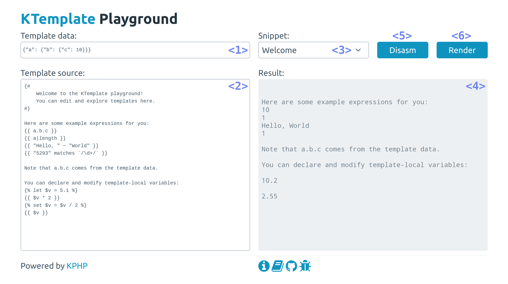

# KTemplate Playground guide



1. **Template Data Source**

This data is used to render the template. When expression like `x.y` is used inside the **template source**, this data will be looked up in the data source; in this case, a JSON like `{"x": {"y": 10}}` would result in `x.y` being evaluated to `10`.

2. **Template Source Code**

This text input is used as a template source code. You can reference the external data inside the template that will be provided by the **template data source** input above.

You can simulate a multi-file template tree by using `--- $filename` separators:

```
--- file1.template

--- file2.template
Hello, world!
```

3. **Template Snippet Selector**

You can pick one of the predefined sets of template data and sources. Try them out, change the template source and see how the rendering output changes.

Note that both template source and data inputs will be overwritten.

4. **Operation Result Display**

This section displays errors, rendering and disassembly results.

If you press "Render", it will hold the template rendering results.

If you press "Disasm", it will hold the template disassembly results.

5. **Disasm Button**

This button compiles the templates and sends the disassembly output to the "result" block.

Disassembly is rarely useful, but it can help you to understand how these templates are being executed. It can also help when reporting some optimization-related (or correctness-related) issues.

If there is a bug that you can spot inside a bytecode, there will be a bad behavior during the template execution as well.

6. **Render Button**

This button compiles the templates and sends their rendering output to the "result" block.
